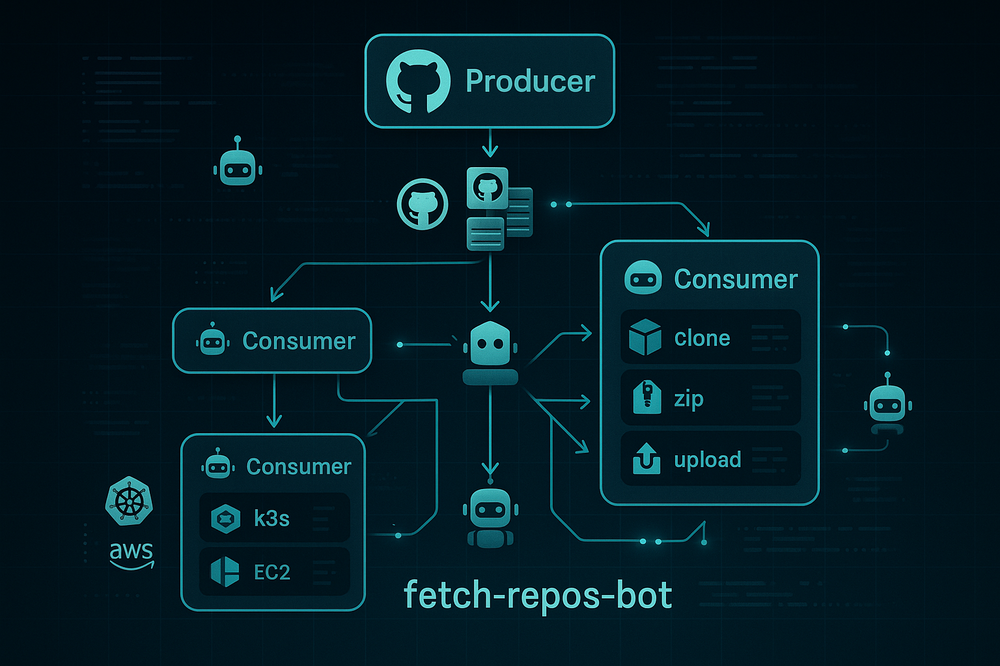

# fetch-repos-bot

[](https://devpod.sh/open#https://github.com/joshyorko/fetch-repos-bot)

<p align="center">
  
</p>


## Overview
**fetch-repos-bot** is an automated Robocorp-based solution for fetching, processing, and managing GitHub repositories from a specified organization. It leverages a robust producer-consumer pattern, supports parallel execution via matrix sharding, and is designed for scalable RPA (Robotic Process Automation) workflows using RCC, Python, and GitHub Actions.

---

## Features
- **Producer-Consumer Architecture:** Efficiently splits work between producer (fetches and shards repo data) and consumer (processes shards in parallel).
- **Matrix Sharding:** Dynamically divides work items into shards for parallel processing, maximizing throughput.
- **Robocorp RCC Integration:** Uses RCC for environment management and task execution.
- **GitHub Actions Workflows:** Includes advanced workflows for both single and matrix-based execution, supporting custom runners and scalable automation.
- **Python & Conda Environment:** All dependencies are managed via `conda.yaml` for reproducibility.

---

## Project Structure

- `assets/logo.png` — Project logo.
- `start.sh` — Local entrypoint to run the full producer-consumer pipeline for local testing and development. This script allows you to execute the entire workflow on your machine, simulating the GitHub Actions process without requiring a remote runner. For more details on Robocorp tasks and local execution, see the [Robocorp Tasks documentation](https://robocorp.com/docs/development-guide/tasks/).
- `robot.yaml` — Robocorp robot configuration, defines tasks and environments.
- `conda.yaml` — Conda environment specification for all dependencies.
- `tasks.py` — Main Python file with Robocorp task definitions for producer and consumer.
- `scripts/` — Helper scripts:
  - `generate_shards_and_matrix.py` — Splits work items into shards and generates the matrix for parallel processing.
  - `shard_loader.py` — Loads the correct shard for each consumer run.
  - `fetch_repos.py` — (Assumed) Logic for fetching repositories.
- `devdata/` — Input/output data, environment files, and work items.
- `output/` — Output directory for artifacts and results.
- `.github/workflows/` — Contains GitHub Actions workflows:
  - `fetch-repos-matrix.yaml` — Matrix-based producer-consumer workflow for parallel execution.
  - `fetch-robocorp.yaml` — Standard producer-consumer workflow.
  - `holotree-vars.yaml` — Workflow for managing RCC holotree variables.

---

## How It Works

1. **Producer Step:**
   - Fetches repository data from the specified GitHub organization.
   - Generates work items and shards them for parallel processing (if using matrix workflow).
   - Uploads output artifacts for consumers.

2. **Consumer Step:**
   - Downloads the relevant shard or work items.
   - Processes each repository as defined in the consumer task.
   - Uploads results as artifacts.

3. **Matrix Workflow:**
   - Uses `generate_shards_and_matrix.py` to split work and create a matrix for parallel jobs in GitHub Actions.
   - Each consumer job processes a shard, maximizing efficiency.

---

## Running Locally

1. **Install RCC:**
   - Download and install RCC from [Robocorp](https://robocorp.com/docs/rcc/installation/).

2. **Run the Pipeline:**
   ```bash
   ./start.sh [MAX_WORKERS]
   ```
   - `MAX_WORKERS` (optional) sets how many shards to create. Defaults to `3`.
   - Set `ORG_NAME` before running if you want to override the organization used
     for the producer.

   The script now runs the consumer once for each shard so you can test the
   sharding workflow locally.

3. **Custom Execution:**
   - You can run individual tasks using RCC or Python as defined in `robot.yaml`.

---

## GitHub Actions Workflows

- **fetch-repos-matrix.yaml:**
  - Supports parallel consumer jobs using matrix strategy.
  - Accepts `org_name` and `max_workers` as inputs.
- **fetch-robocorp.yaml:**
  - Simpler, sequential producer-consumer workflow.
- **holotree-vars.yaml:**
  - Utility workflow for managing RCC holotree variables on specific runners.

---

## Environment & Dependencies

- All dependencies are managed via `conda.yaml`.
- Python 3.12, Robocorp, pandas, requests, gitpython, and more.
- See `conda.yaml` for full details.

---

## License

This project is licensed under the Apache License 2.0. See [LICENSE](LICENSE) for details.

---

## Contributing

Contributions are welcome! Please open issues or submit pull requests for improvements, bug fixes, or new features.

---

## References
- [Robocorp Documentation](https://robocorp.com/docs/)
- [RCC Documentation](https://github.com/robocorp/rcc)
- [GitHub Actions Documentation](https://docs.github.com/en/actions)
